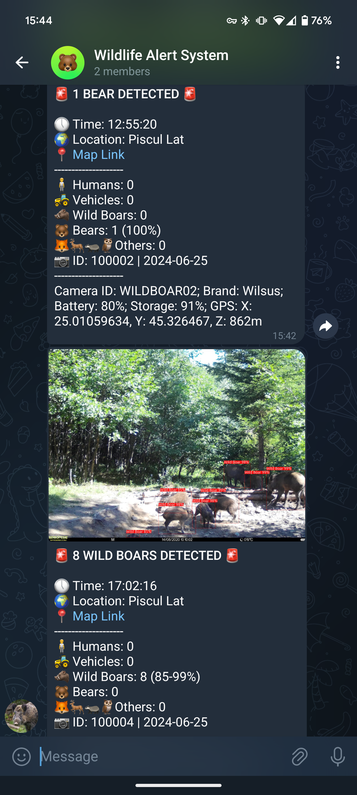
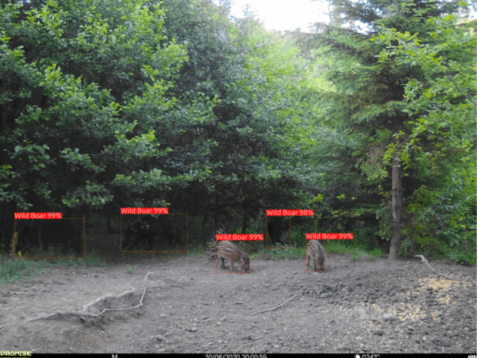

# AI for Wildlife Monitoring
### A Real-Time Wildlife Alert System for European Mammals

Thomas Ratsakatika | AI and Environment Researcher | University of Cambridge

<table style="border-collapse: collapse; border: none;">
  <tr align="center" style="border: none;">
    <td align="center" style="border: none;">
      
    </td>
    <td align="center" style="border: none;">
      
    </td>
  </tr>
</table>

Photo credits: [Fundația Conservation Carpathia](https://www.carpathia.org/) ©

## 🐻 Overview 🐗

A project to detect bears and wild boar in camera traps located in the Romanian Carpathian Mountains

## 🚀 Get Started

- Example notebook
- Scripts

## 📂 Project Structure

### 🛠️ Setup

### 🤖 Models

The pretrained DeepFaune models can be downloaded here: https://pbil.univ-lyon1.fr/software/download/deepfaune/v1.1/

### 📷 Data
Example photos

## Contact

## Licence

### Citation

## Acknowledgements

<table>
    <tr align="center">
    <!-- University of Cambridge Logo -->
    <td align="center">
      
    </td>
    <!-- UKRI Logo -->
    <td align="center">
      
    </td>
  </tr>
</table>
